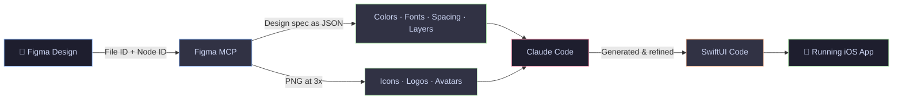
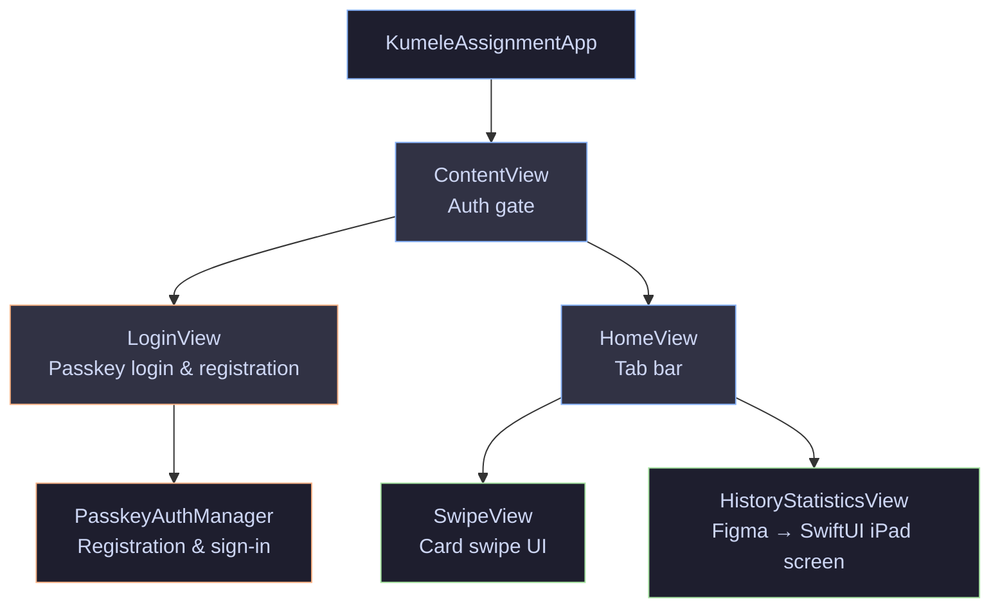

# Kumele Assignment

A demo iOS app built as part of a client test task for Kumele, a hobby-matching platform. The project has two parts: a swipe-based card UI with Passkey login, and a Figma design converted into a fully working iPad SwiftUI screen.

---

## Demo

### Swipe Animation + Passkey Login

https://github.com/user-attachments/assets/ec882a8e-fae1-48c0-b98d-0c201d8faad8

### History & Statistics (iPad)

https://github.com/user-attachments/assets/a7b7f3de-4e53-46ab-9c50-d14581287069

---

## Getting Started

```bash
git clone https://github.com/GaneshRajuGalla/KumeleAssignment.git
```

Open `KumeleAssignment.xcodeproj` in Xcode, then:

- Run on an **iPhone** to try the swipe animation and Passkey login
- Run on an **iPad** to see the History & Statistics screen

> Requires Xcode 26+ and iOS / iPadOS 26+

---

## Features

### Part 1 — Swipe Animation + Passkey Login

Swipe cards built with SwiftUI and native Passkey login using Face ID / Touch ID via `AuthenticationServices`. Use **Skip to Demo Mode** to explore the app without registering.

> For full passkey support in production, the server needs to host an Apple App Site Association file and WebAuthn endpoints. The app entitlement is already configured.

---

### Part 2 — Figma to SwiftUI (iPad)

The **History & Statistics** screen was built by reading the Figma design file directly through the Figma API. No manual layer inspection needed. Every color, spacing value, font size, and asset was pulled straight from the design and translated into SwiftUI code.

**Workflow**



---

## Project Structure



---

## Author

Ganesh Raju Galla
